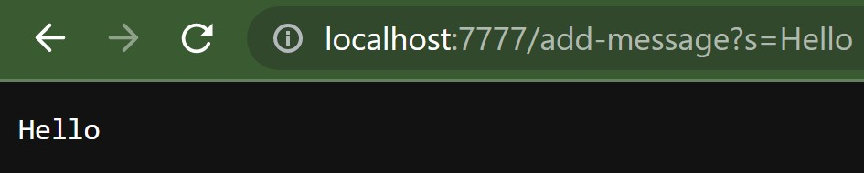
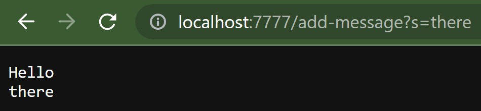

# Lab Report 2

## Part 1 - StringServer showcase

StringServer.java creates a local server on port 7777. By navigating to http://localhost:7777/, the user can go to path http://localhost:7777/add-message?s= and enter any word or legal characters after the `=`. Doing so will output each input the server receives in order. 

Here is an example:

Here, the query is "Hello". Navigating to the `/add-message` path calls the `handleRequest` method in StringServer.java. The string of characters after `/add-message/` is saved in an array called `parameters`, with index 0 containing everything to the left of the `=`, and index 1 containing everything to the right of the `=`. The characters after the `?s=` will be saved in a String called `result`. 

