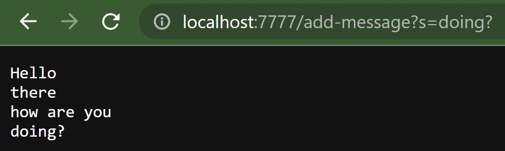

# Lab Report 2

## Part 1 - StringServer showcase

StringServer.java creates a local server on port 7777. By navigating to http://localhost:7777/, the user can go to path http://localhost:7777/add-message?s= and enter any word or legal characters after the `=`. Doing so will output each input the server receives in order. 

Here is an example:

