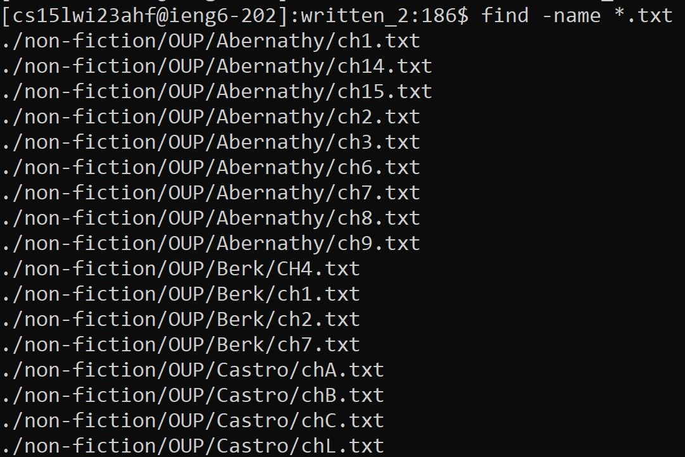

# Lab Report 3 - Exploring the `find` command

## The `find` command
The `find` command in Linux is used to locate files, directories, and more within specific directories. As is with many commands in Linux the `find` command
comes with a variety of options. In this report, we will be exploring the `-name`, `-newer`, `-print`, and `-empty` options.

## The `-name` option
Putting the `-name` option after the `find` command will search for specific files based on the specified information after the command.

__Example 1:__

The above command outputs the exact address of the file `HistoryGreek.txt`; this is especially useful because the command was able to find a file not directly located in `written_2`.

__Example 2:__

You can also search for files by file types using the `-name` option. Here, we searched for all files containing ".txt" (all files not shown in screenshot).

## The `-newer` option
The `-newer` option allows you to search for files that were created after a specified file.

__Example 1:__

In this example, we relocated into the `travel_guides/berlitz2` directory and searched for all files newer than `Portugal-History.txt`.

__Example 2:__

As seen in this exapmle, you can also supply the directory as an argument instead of relocating into it.

## The `-print` option
The `-print` option is an interesting one because it seems to be redundant:

__Example 1:__

Seeing as ommitting `-print` has the same output, we can conclude that the default action for the `find` command in general to is to print the output of its results:

__Example 2:__

However, it is still good to know about this option.

## The `-empty` option
The `-empty` option lists empty files and directories. For the purposes of this example, I created an empty directory called `empty_dir` within the `travel_guides` subfolder of `written_2`.

__Example 1:__

As shown above, the command was able to find the only empty within `travel_guides`, namely `empty_dir`.

This option works even if the empty folder is not directly within the working directory:

__Example 2:__

The command above returned the current directory.

____________________________________________________________________________________________________________________________________________________________
Information acquired from the following source: https://www.geeksforgeeks.org/find-command-in-linux-with-examples/
