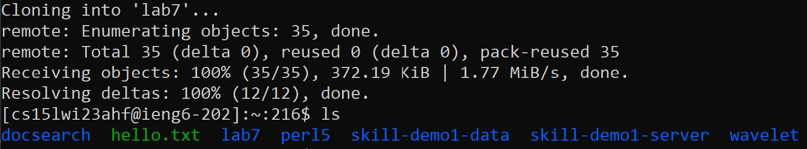

# Lab Report 4 - Reproducing the In-Class Competition Task

__Disclaimer:__ Before beginning this task, I already created public SSH keys for GitHub and forked the repository onto my account.

## Step 1 - Logging into ieng6

I typed in ``ssh cs15lwi23ahf@ieng6.ucsd.edu`` into command prompt to access my ieng6 account remotely.

We are now accessing the remote server.

## Step 2 - Cloning the repository fork into my account

On the GitHub page containing my fork, I pressed the green "Code" dropdown and clicked on "SSH".

I copied the given URL and ran the following command (with the actual URL replacing the `<URL>` from the screenshot):

`lab7` is now located in my remote directory.

## Step 3 - Running and confirming the failure of the JUnit tests

After going into the `lab7` directory, I entered the following commands:

Compiling the java files: `javac -cp .:lib/hamcrest-core-1.3.jar:lib/junit-4.13.2.jar *.java`
Executing the JUnit file: `java -cp .:lib/hamcrest-core-1.3.jar:lib/junit-4.13.2.jar org.junit.runner.JUnitCore ListExamplesTests` 
(Note: I typed "List<tab>Tests" at the end)

Here are the input and output of those commands:

The output at the bottom shows that there is 1 failure as expected.

## Step 4 - Editing and fixing the file

I typed `nano List<tab>.java` to access the file editor.

I scrolled down with the down and right arrow keys until I got to the follow code segment:

I switched the variable `index1` with `index2`.

I then pressed "Ctrl+O", the <enter> key, and "Ctrl+X" to save the file under the given name and exit the file editor (in that order).

## Step 5 - Running and confirming the success of the JUnit tests

Instead of finding and copy-pasting the same commands from Step 3, I accessed them from my command line history by pressing the up arrow key 4 times to access the compilation command, pressing enter, then pressing the up arrow key 4 times again to access the execution command, and pressing enter to run the JUnit file:

The bottom of the output shows zero failures, meaning the code fix from step 4 worked.

## Step 6 - Committing and pushing the changes

To update the `ListExamples.java` file, I typed `git add List<tab>.java`. I then committed the changes using the command `git commit -m "Bug fix". Finally, I pushed the changes with `git push origin main`. Here are the input and output of that process:

________________________________________________________________________________________________
The files have now been fixed and are updated in my forked repository!
