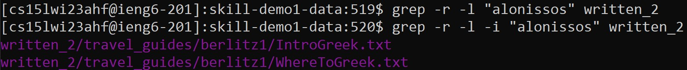
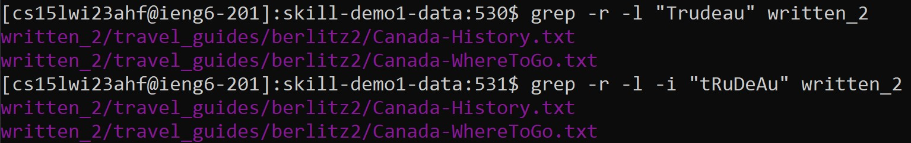
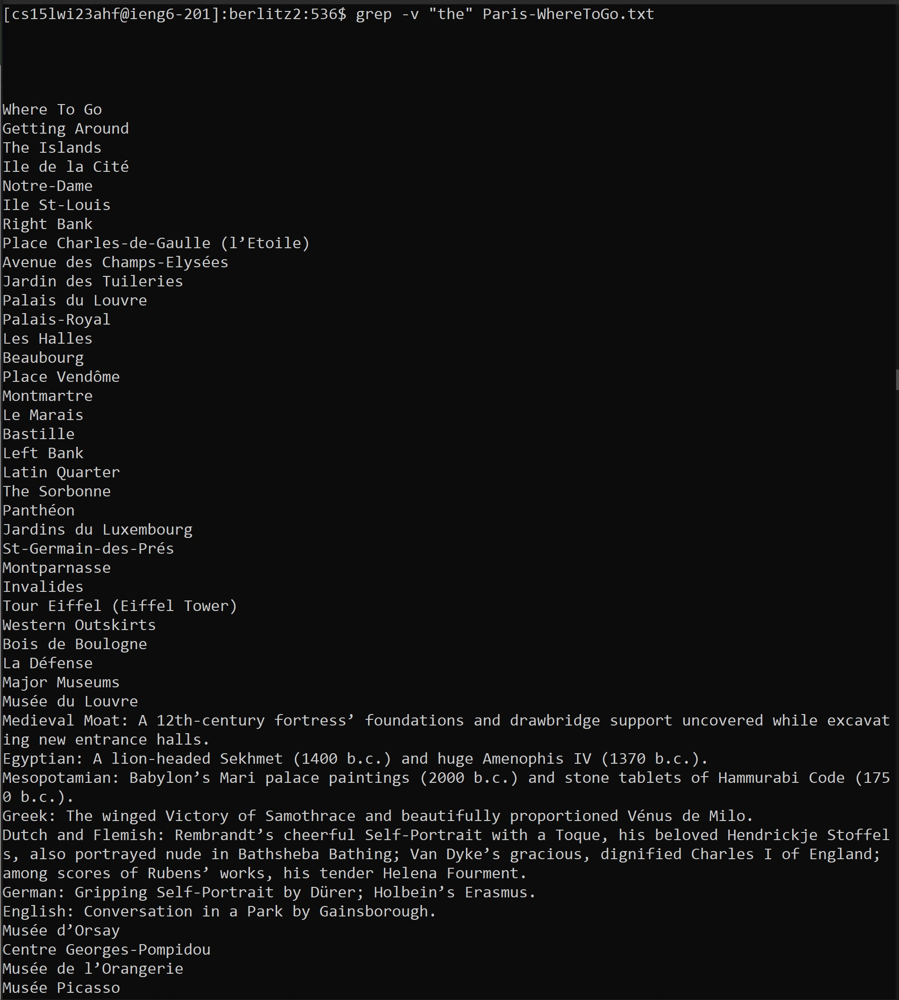
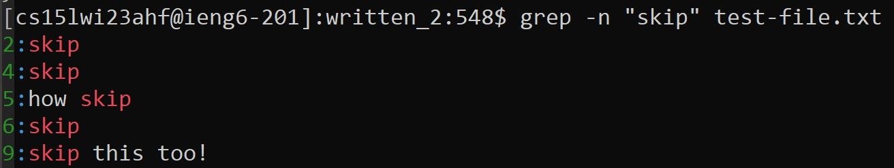
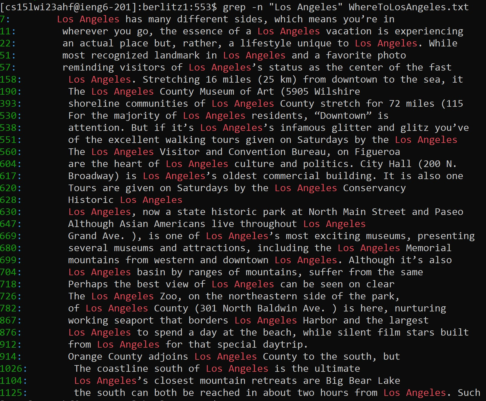
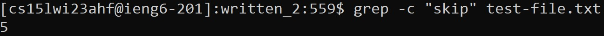
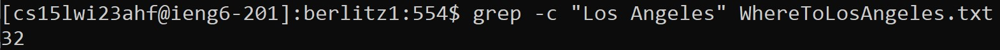

# Lab Report 5 - Exploring the `grep` command 

## The `grep` command
Standing for "global regular expression print", the `grep` command in Linux is used to locate text patterns within specific files or files within a directory. 
Much like the `find` command, the `grep` command also has various options to narrow down searches. In this report, we will be exploring the `-i`, `-v`, `-n`, 
and `-c` options.

## The `-i` option
Adding the `-i` option after a `grep` command will search for the given string in a case-insensitive manner.

__Example 1:__

In the example above, searching for the string "alonissos" without the `-i` option yields no results, but adding it returns the two text files that the string "Alonissos" is located in.

__Example 2:__

This example shows that the `-i` option is truly case-insensitive as searching for "Trudeau" and "tRuDeAu" yield the same results.

## The `-v` option
The `-v` option inverts the normal `grep` command and returns every line that does *not* contain the specified string.

__Example 1:__

Here is every line in Paris-WhereToGo.txt that doesn't contain the word "the".

__Example 2:__

For this example, I created a .txt file with a simple greeting interrupted by various lines containing the word "skip". Using the `-v` option on the word "skip" returns every line without that word, making the greeting clear.

## The `-n` option
Rather than returning the file that a specified string is located, adding the `-n` option will return the line number of the string's location along with the line itself.

__Example 1:__

Running grep with `-n` option on the word "skip" on the same I file I created for the last example returns lines 2, 4, 5, 6, and 9.

__Example 2:__

Here is every line in WhereToLosAngeles.txt that contains the string "Los Angeles".

## The `-c` option
The `-c`option returns the number of occurrences of a given string.

__Example 1:__

The word "skip" in the text file I created occurs 5 times, according to the `-c` option.

__Example 2:__

In WhereToLosAngeles.txt, the name "Los Angeles" occurs 32 times.

____________________________________________________________________________________________________________________________________________________________
Information acquired from the following source: https://www.freecodecamp.org/news/grep-command-in-linux-usage-options-and-syntax-examples/
